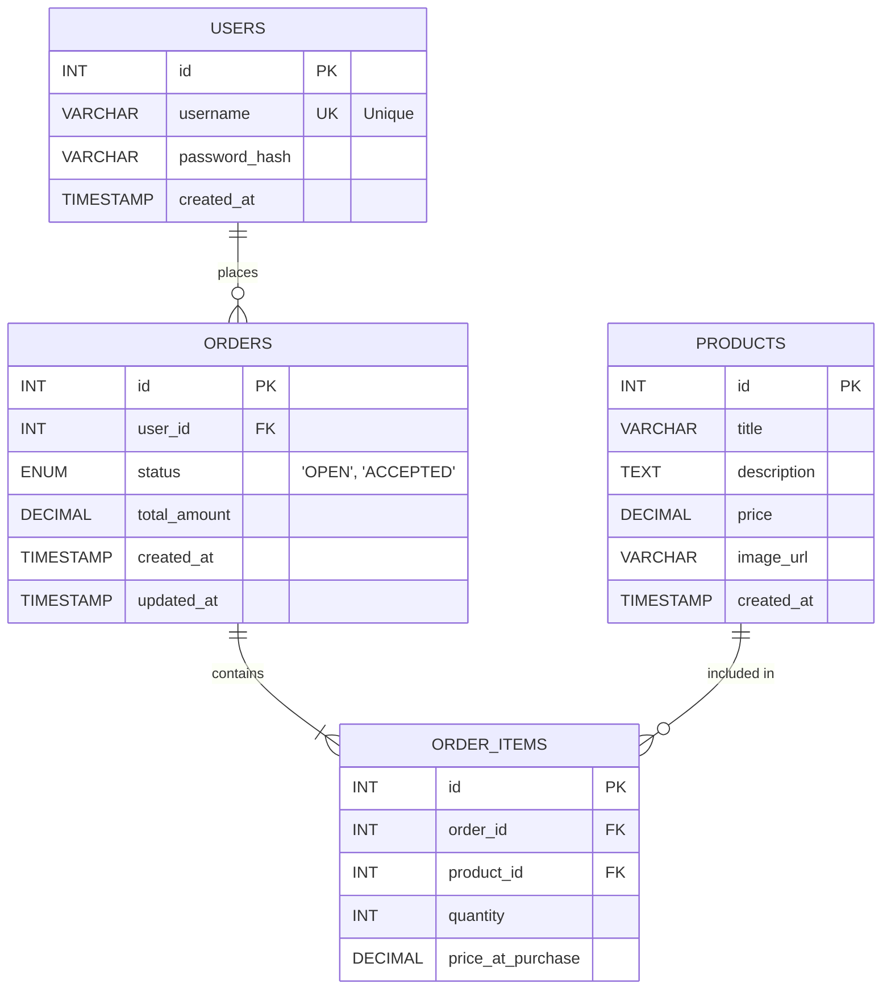

# 🛒 Basic Store Database Setup & Testing

This repository contains the database schema, setup scripts, and test suite for the Basic Store Micro-App. 

## 🚀 Quick Start

### 🔗 Prerequisites

Ensure you have the following installed on your system:
* Node.js installed
* SQLite3 installed (for CLI operations)
* `better-sqlite3` npm package

---

## 📝 Commands Reference

Follow these steps in your terminal (PowerShell) to set up the project from scratch.

### 1. Installation & Setup
```powershell
# Install SQLite3 via Windows Package Manager
winget install SQLite.SQLite

# Initialize a new Node.js project
npm init -y

# Install the required SQLite library for Node
npm install better-sqlite3
```

### 2. Database Initialization
```powershell
# Initialize the database schema (creates basicstore.db)
Get-Content init_db.sql | sqlite3 basicstore.db

# Seed the database with initial test data
Get-Content insert_data.sql | sqlite3 basicstore.db
```

### 3. Running Scripts and Tests
```powershell
# Run basic select queries to verify data insertion
node db_select.js

# Run the automated database test suite
node --test db_test.js 
```

---

## 📊 Database Schema (ER Diagram)

Below is the Entity-Relationship (ER) diagram representing the database architecture.



### Schema Explanation
* **USERS:** Stores user authentication data. The `username` field has a `UNIQUE` constraint to prevent duplicate registrations.
* **PRODUCTS:** Represents the catalog of items available in the store.
* **ORDERS:** Represents a user's shopping cart or completed checkout. It is linked to the `USERS` table and restricted by a status of either `OPEN` or `ACCEPTED`.
* **ORDER_ITEMS:** The "join table" that maps multiple products to a specific order. It records the `quantity` and the specific `price_at_purchase` to ensure historical order totals remain accurate even if product prices change in the future.

### Relationships Explained
* **1-to-Many (`USERS` to `ORDERS`):** One user can place many orders. If a user is deleted, their orders are automatically deleted (`ON DELETE CASCADE`).
* **1-to-Many (`ORDERS` to `ORDER_ITEMS`):** An order contains multiple items. If an order is canceled/deleted, the items within that cart are deleted (`ON DELETE CASCADE`).
* **1-to-Many (`PRODUCTS` to `ORDER_ITEMS`):** A single product can be part of many different orders. You **cannot** delete a product if it is already tied to an existing order (`ON DELETE RESTRICT`).

---

## 🧪 About the Test Suite (`test_db.js`)

The `test_db.js` file utilizes Node.js's native test runner (`node:test`) and the `better-sqlite3` library to validate the structural integrity of the database.

### How it Works
1. **In-Memory Execution:** Instead of modifying your physical `basicstore.db` file, the `before()` hook creates an isolated, temporary database in RAM using `new Database(':memory:')`. It then executes the `init_db.sql` schema into this temporary space.
2. **Foreign Keys:** It explicitly enables `PRAGMA foreign_keys = ON`, as SQLite disables them by default.
3. **Automated Teardown:** After all tests run, the `after()` hook closes the connection, completely wiping the temporary database clean.

### What is being tested? (Test Results)

Below are the 11 test cases executed against the database schema to ensure constraints and relationships work exactly as expected. 

**📦 `products` Table**
* **Test 1:** should insert and retrieve a Product successfully ➔ **[ ✔ Passed ]**

**👥 `users` Table**
* **Test 2:** should insert and retrieve a user successfully ➔ **[ ✔ Passed ]**
* **Test 3:** should fail to insert user without password_hash (NOT NULL constraint) ➔ **[ ✔ Passed ]**
* **Test 4:** should fail to insert a duplicate username (UNIQUE constraint) ➔ **[ ✔ Passed ]**

**🛒 `orders` Table**
* **Test 5:** should insert and retrieve an Order ➔ **[ ✔ Passed ]**
* **Test 6:** should fail to insert Order with invalid status (CHECK constraint) ➔ **[ ✔ Passed ]**

**🔗 `order_items` Table (Relationships & Constraints)**
* **Test 7:** should insert order_item with valid foreign keys ➔ **[ ✔ Passed ]**
* **Test 8:** should fail to insert order_item with non-existent order_id (FK constraint) ➔ **[ ✔ Passed ]**
* **Test 9:** should fail to insert order_item with non-existent product_id (FK constraint) ➔ **[ ✔ Passed ]**
* **Test 10:** ON DELETE CASCADE: should delete order_items when the parent order is deleted ➔ **[ ✔ Passed ]**
* **Test 11:** ON DELETE RESTRICT: should fail to delete a product if it is part of an order ➔ **[ ✔ Passed ]**

> **Test Summary:** 
> ℹ **Tests run:** 11 | 🟢 **Passed:** 11 | 🔴 **Failed:** 0 | ⏱ **Duration:** ~103ms
