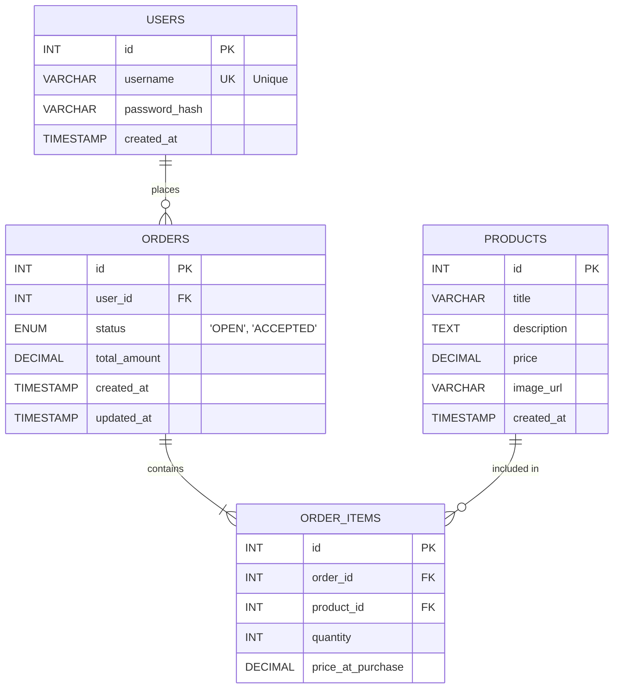

```mermaid
erDiagram
    %% Entities and their attributes
    USERS {
        INT id PK
        VARCHAR username UK "Unique"
        VARCHAR password_hash
        TIMESTAMP created_at
    }

    PRODUCTS {
        INT id PK
        VARCHAR title
        TEXT description
        DECIMAL price
        VARCHAR image_url
        TIMESTAMP created_at
    }

    ORDERS {
        INT id PK
        INT user_id FK
        ENUM status "'OPEN', 'ACCEPTED'"
        DECIMAL total_amount
        TIMESTAMP created_at
        TIMESTAMP updated_at
    }

    ORDER_ITEMS {
        INT id PK
        INT order_id FK
        INT product_id FK
        INT quantity
        DECIMAL price_at_purchase
    }

    %% Relationships
    USERS ||--o{ ORDERS : "places"
    ORDERS ||--|{ ORDER_ITEMS : "contains"
    PRODUCTS ||--o{ ORDER_ITEMS : "included in"
```
