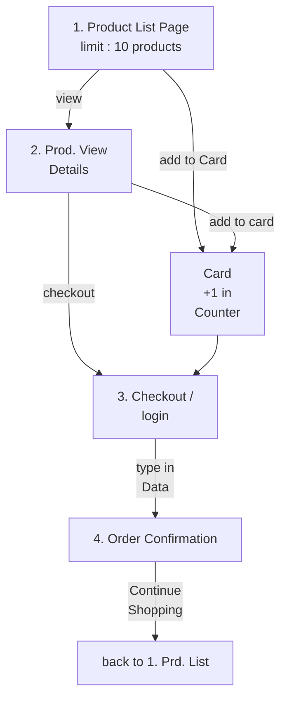

```mermaid
graph TD
    A["1. Product List Page<br>limit : 10 products"]
    B["2. Prod. View<br>Details"]
    C["Card<br>+1 in<br>Counter"]
    D["3. Checkout /<br>login"]
    E["4. Order Confirmation"]
    F["back to 1. Prd. List"]

    A -->|view| B
    A -->|add to Card| C
    B -->|add to card| C
    B -->|checkout| D
    C --> D
    D -->|type in<br>Data| E
    E -->|&quot;Continue<br>Shopping&quot;| F
```
