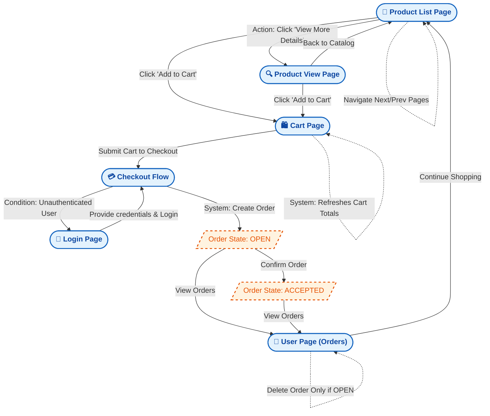

```mermaid
---
config:
  layout: dagre
---
flowchart TB
    PLP(["🛒 Product List Page"]) -- Action: Click 'View More Details' --> PVP(["🔍 Product View Page"])
    PVP -- Back to Catalog --> PLP
    PLP -. Navigate Next/Prev Pages .-> PLP
    PLP -- Click 'Add to Cart' --> CP(["🛍️ Cart Page"])
    PVP -- Click 'Add to Cart' --> CP
    CP -. Adjust Item Quantity .-> CP
    CP -. System: Refreshes Cart Totals .-> CP
    CP -- Submit Cart to Checkout --> CO(["💳 Checkout Flow"])
    CO -- Condition: Unauthenticated User --> LP(["🔐 Login Page"])
    LP -- Provide credentials & Login --> CO
    CO -- System: Create Order --> StateOpen[/"Order State: OPEN"/]
    StateOpen -- Confirm Order --> StateAccepted[/"Order State: ACCEPTED"/]
    StateOpen -- View Orders --> UP(["👤 User Page (Orders)"])
    StateAccepted -- View Orders --> UP
    UP -. Delete Order Only if OPEN .-> UP
    UP -- Continue Shopping --> PLP

     PLP:::page
     PVP:::page
     CP:::page
     CO:::page
     LP:::page
     StateOpen:::system
     StateAccepted:::system
     UP:::page
    classDef page fill:#E3F2FD,stroke:#1565C0,stroke-width:2px,color:#0D47A1,font-weight:bold
    classDef system fill:#FFF3E0,stroke:#E65100,stroke-width:2px,stroke-dasharray:5 5,color:#E65100
```
