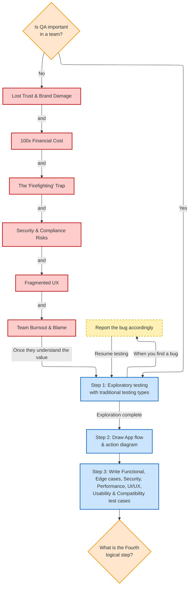

<pre>

```mermaid
---
config:
  layout: elk
---
flowchart TB
    Start{"Is QA important <br> in a team?"} -- No --> first["Lost Trust & Brand Damage"]
    first -- and --> second["100x Financial Cost"]
    second -- and --> third["The 'Firefighting' Trap"]
    third -- and --> fourth["Security & Compliance Risks"]
    fourth -- and --> fifth["Fragmented UX"]
    fifth -- and --> sixth["Team Burnout & Blame"]
    sixth -- Once they understand the value --> Step1["Step 1: Exploratory testing <br> with traditional testing types"]
    Start -- Yes --> Step1
    Step1 -- When you find a bug --> ReportBug["Report the bug accordingly"]
    ReportBug -- Resume testing --> Step1
    Step1 -- Exploration complete --> Step2["Step 2: Draw App flow <br> &amp; action diagram"]
    Step2 --> Step3["Step 3: Write Functional, Edge cases, Security, <br> Performance, UI/UX, Usability &amp; Compatibility test cases"]
    Step3 --> FinalQuestion{"What is the Fourth <br> logical step?"}

    third@{ shape: rect}
     Start:::decision
     first:::noPath
     second:::noPath
     third:::noPath
     fourth:::noPath
     fifth:::noPath
     sixth:::noPath
     Step1:::yesPath
     ReportBug:::bugPath
     Step2:::yesPath
     Step3:::yesPath
     FinalQuestion:::decision
    classDef decision fill:#ffe6cc,stroke:#ff9900,stroke-width:2px,color:#333
    classDef noPath fill:#ffcccc,stroke:#cc0000,stroke-width:2px,color:#333
    classDef yesPath fill:#cce5ff,stroke:#0066cc,stroke-width:2px,color:#333
    classDef bugPath fill:#fff0b3,stroke:#e6b800,stroke-width:2px,stroke-dasharray: 5 5,color:#333
```
</pre>
